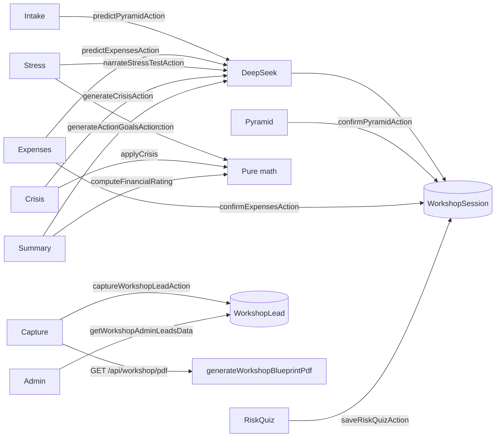

# Workshop Pyramid Lab — Source of Truth

**This document is the single source of truth** for the hidden Workshop Pyramid Lab.  
If implementation and this doc disagree, update this doc when you change the feature.

| Item | Value |
|------|--------|
| **Product name** | Workshop Pyramid Lab |
| **Version** | v5 (simplified game: no goal types, no monthly investing, no fun budget, no retirement nest egg; goal-reach timeline fixes; retirement finale removed) |
| **Public URL (production)** | https://profitpulseally.com/workshop/pyramid |
| **Local URL** | http://localhost:3000/workshop/pyramid |
| **Admin leads** | `/admin/workshop` (ADMIN only) |
| **Status** | Live workshop tool (pilot / session use) — **not** Market Pulse, Matching Pulse, or Fortify |
| **Discovery** | Direct URL / QR only — **no** homepage, nav, or footer links |
| **App root** | Project root (Next.js App Router + React + TypeScript) |

---

## 1. Product intent

Workshop Pyramid Lab is a **private, full-page wizard** for live sessions (e.g. QR on a slide). Attendees:

1. Pick an **AI advisor tone**, then enter a simple profile (age, income, industry, household).
2. Get an AI-estimated **4-layer pyramid** (Protection → Emergency Fund → Goals → Investment), tune against deterministic benchmarks (green/amber/red), then confirm. Step intro is a single line: **"Tune each layer, Confirm and save"** (EN / 繁).
3. Review and edit an AI-guessed **monthly expenses** breakdown (5 categories; total is always a deterministic sum).
4. Run a **life-timeline stress test** with a **goal journey**: overview donuts → age-sequenced **spend-goal** rail (Apply / Give up / optional squeeze). Every goal is a spend goal — there are no goal types and no retirement nest egg. The reach age shown on each goal card is recomputed from the deterministic timeline whenever the user toggles "use emergency fund / investments" or accepts a squeeze. (Retirement finale charts were removed in v5.)
5. Take a **5-question risk quiz** → conservative / balanced / aggressive profile (+ optional journey-consistency line).
6. See a **financial rating (0–100)** and pick a **#1 action goal**. On Summary mount, a deterministic **Crisis Stress Test** runs silently (`crisis-stress-test.ts`) against the final mutated plan and feeds the Crisis Resilience sub-score.
7. Capture name / email / **required phone** → download a **graphical AI Financial Blueprint** PDF (includes **Your Plan Decisions**).

**v5 removals (simplification):** the goalType choice (spend vs retirementTarget) is gone — every goal is a spend goal; `monthlyInvestmentHKD` (monthly investing) is gone from the game; `monthlyFunHKD` (fun budget) is gone entirely (expenses + surplus only); the retirement nest egg is gone (no retirementTarget projections, no retirement finale charts/scrubber, no retirement snapshot in the PDF, no retirement-readiness in the rating). The engine still simulates a retirement phase internally (salary stops, passive income from invested, drawdown) — it is just no longer a user-facing feature.

**Core rule:** DeepSeek (`callDeepSeek` / `callDeepSeekParsed`) = guesses, narrative, and tone only. **All math** (benchmarks, stress test, squeeze solver, rating, impact points, expense totals, risk quiz score) = pure TypeScript.

**Hard constraints (do not violate):**

- Do **not** change Market Pulse scoring, reveal gating, PPA privacy, launch gating, playability, or admin cycle logic.
- Do **not** modify Matching Pulse marketplace behavior or Fortify (`/fortify-survey`, `FortifyYourFutureSurvey.tsx`).
- Do **not** create duplicate users from workshop forms — leads are **not** Auth.js `User` rows.
- Workshop code lives under workshop paths only (see §3). Keep isolation.

---

## 2. Public entry & QR

### Canonical URL

```text
https://profitpulseally.com/workshop/pyramid
```

- Scheme: `https`
- Host: `profitpulseally.com` (**no** `www`)
- Path: `/workshop/pyramid` (**no** trailing slash required)
- No query params required for the base experience

### QR for live sessions

1. Paste the canonical URL into any free QR generator.
2. Export PNG/SVG; prefer high error correction for projection/print.
3. Before the room: scan on a phone and confirm intake loads.
4. Leave quiet margin around the code; do not stretch non-uniformly.

Local check after deploy:

```bash
curl -sI "https://profitpulseally.com/workshop/pyramid" | head -5
```

Expect `200` (or a redirect that still resolves to this path), not `404`.

---

## 3. File map (owned surfaces)

| Area | Paths |
|------|--------|
| Public page | `src/app/workshop/pyramid/page.tsx`, `loading.tsx` |
| Admin page | `src/app/admin/workshop/page.tsx` |
| PDF API | `src/app/api/workshop/pdf/[sessionId]/route.ts` |
| UI | `src/components/workshop/*` (incl. `CollapsibleWidget`, `WorkshopToneSelector`, step components) |
| Admin table | `src/components/admin/workshop/WorkshopLeadsAdminTable.tsx` |
| Domain lib | `src/lib/workshop/*` |
| Schema | `WorkshopSession`, `WorkshopLead` in `prisma/schema.prisma` |
| Route chrome | `/workshop/pyramid` in `FULL_PAGE_ROUTES` (`src/lib/layout/route-chrome.ts`) |
| Admin overview link | Secondary text in `AdminOverviewCards.tsx` |
| i18n (wizard) | `src/lib/i18n/messages/workshop-messages.ts` + `workshop-messages.zh-Hant.ts` (same split-catalog pattern as `acquisition-messages.ts`); registered via `en.ts` / `zh-Hant.ts` |
| i18n (admin link) | `auth.admin.quickActions.workshopLeads` in `auth-app-messages.ts` |
| CJK PDF font | `public/fonts/noto-sans-tc/` (Noto Sans TC Regular + Bold, SIL OFL) |

**Intentionally outside / must not grow into:** homepage, site nav/footer, Market Pulse libs, Matching Pulse request board, Fortify survey.

---

## 4. Routes & chrome

| Route | Auth | Chrome | Notes |
|-------|------|--------|--------|
| `/workshop/pyramid` | Public (no login) | Full page (no site header/footer) | `robots: { index: false, follow: false }` |
| `/admin/workshop` | ADMIN session | Full page (under `/admin`) | Non-admin → `redirect("/")` |
| `GET /api/workshop/pdf/[sessionId]` | None | N/A | Requires existing lead for that session; Node runtime |

**Metadata (public):**

- Title: `Workshop Pyramid Lab | Profit Pulse Ally`
- Description: `Private workshop pyramid lab session.`

**Loading:** `src/app/workshop/pyramid/loading.tsx` — obsidian skeleton, “Loading workshop…”.

---

## 5. Wizard flow (UI)

Orchestrator: `src/components/workshop/WorkshopWizard.tsx`  
Step order SSOT: `src/lib/workshop/wizard-steps.ts` (`TOTAL_STEPS = 7`).

```text
intake → pyramid → expenses → stresstest → riskquiz → summary → capture
```

| Step | Component | What the user sees |
|------|-----------|--------------------|
| **intake** | Inline in `WorkshopWizard` + `WorkshopToneSelector` | Colorful tone cards (required) + age + **retirement age** (default 65, 40–80, must be > age) + monthly income (HKD), industry (+ chips), household → “Analyze my pyramid” |
| **pyramid** | `WorkshopPyramidStep` + layer editors | Clip-path pyramid graphic + Protection / Emergency Fund / Goals / Investment editors → Confirm |
| **expenses** | `WorkshopExpensesStep` | AI-guessed 5 monthly categories; live deterministic total → Confirm |
| **stresstest** | `WorkshopStressTestStep` | **(1)** Overview dual large `WorkshopAllocationDonut`s (`WorkshopGoalJourneyOverview` + surplus intro). **(2)** Headline coverage / depletion cards + EF collapsible (AI notes on amber/red/oversaved). **(3)** `WorkshopGoalJourneyRail` — age-sorted **spend goals only**; lock until earlier decisions; card interiors = outlook + liquidation toggle + compact Current/Recommended squeeze donuts + Apply/Give up. **(4)** Separate `WorkshopGoalJourneyFinaleCard` below the rail once all spend goals decided: remounted dual cash-flow/asset **line** charts + age scrubber + decision recap. Sticky footer **Continue to Risk Quiz** enables only after finale unlocked; Continue syncs mutated pyramid/expenses into the wizard. |
| **riskquiz** | `WorkshopRiskQuiz` | Bridge intro + 5 tappable questions → profile result + optional journey-consistency line → Summary |
| **summary** | `WorkshopSummaryStep` | SVG rating gauge, silent Crisis Stress Test badge, breakdown bars, 3 selectable action goals |
| **capture** | `WorkshopCaptureStep` | Name, email, **required** phone → PDF download |

### Tone system

Defined in `src/lib/workshop/tone.ts` / `WorkshopTone`. Picker UI: `WorkshopToneSelector`.

| Id | Label | Lucide icon | Picker personality |
|----|--------|-------------|-------------------|
| `fun` | Fun & Metaphorical | `Gamepad2` | Violet → fuchsia gradient; tilted icon well |
| `professional` | Professional & Formal (session default) | `BriefcaseBusiness` | Slate → sky; squared icon well |
| `simple` | Simple & Educational | `Lightbulb` | Cyan → teal; soft rounded well |
| `direct` | Direct & No-Nonsense | `Zap` | Amber → rose; sharp well; **uppercase** label |
| `warm` | Warm & Encouraging | `HeartHandshake` | Rose → orange → amber; round well |

**Picker UX (`WorkshopToneSelector`):**

- 2-column grid on mobile / 5-column on `lg+`; large centered icons (56–64px wells); **label only** (no description subcopy on the button)
- Each card is **always colorful** (idle + selected), not only after selection — selected adds ring, lift, and a tone-colored check
- i18n still has `workshop.tone.options.*.description` keys for potential reuse; the intake picker does **not** render them

`getToneInstruction(tone)` is injected into every DeepSeek system prompt so narrative output stays distinctly different per tone. Tone is stored on `WorkshopSession.tone`.

**Downstream chrome:** `getToneUiTheme(tone)` returns Tailwind tokens (`badgeClass`, `cardAccentClass`, `headingStyle`, `iconEmoji`) for crisis / stress / summary surfaces. The intake picker uses its own `TONE_PICKER` map (distinct from `getToneUiTheme`) so cards stay playful and high-contrast.

### Intake options (hard-coded)

**Industry chips / suggestions:** Tech, Finance, Healthcare, Legal, Real Estate, Civil Service, Education, F&B/Hospitality, Self-Employed, Other (free text also allowed).

**Household status:** Single, Married no kids, Married with kids, Single parent.

### Pyramid layers (v2 shapes)

Canonical type: `PyramidState` in `src/lib/workshop/types.ts`.

| Key | Label | Editor | Meaning |
|-----|-------|--------|---------|
| `protection` | Protection | `ProtectionLayerEditor` | Medical coverage % + critical illness amount (HKD) |
| `emergencyFund` | Emergency Fund | `EmergencyFundLayerEditor` | Saved amount (HKD) |
| `goals` | Goals | `GoalsLayerEditor` | List of goals (icon, label, target amount, target age, **`goalType`**: `spend` \| `retirementTarget`) |
| `investment` | Investment | `InvestmentLayerEditor` | Risk L/M/H (sum 100) + **`lumpSumHKD`** (current invested capital). Monthly investing and monthly fun are removed (v5). |

**v3 goal timing:** `GoalItem.targetAge` is SSOT; `targetYear = deriveGoalYear(targetAge, userAge)` in `goal-year.ts`. Old sessions with only `targetYear` derive `targetAge` on parse. There is no `goalType` in v5 — every goal is a spend goal (legacy `goalType` JSON is dropped on normalize).

**Return rates (math only):** `investment-returns.ts` — real `RETURN_RATES` `{ low: −0.01, mid: 0.03, high: 0.07 }` + `LIQUID_REAL_RETURN −0.03` + `blendedAnnualReturn(alloc)`. UI display bands are copy-only.

**Life timeline engine (v4/v5):** `src/lib/workshop/timeline-engine.ts` — `runLifeTimeline` / `goalStatusAtYear`. Pure TS year-by-year to age 90 (working salary via existing `advanceMonthlyIncomeForYear`; **all** working-year surplus → liquid — no monthly-investing input; spend goals pay liquid first and **only liquidate invested when `allowLiquidation` is true**; retired salary 0 + passive = invested × blended rate; drawdown liquid→invested; EF `oversaved` at 1.5× target). Wizard stress step calls `runLifeTimelineAction`. Goal-journey re-runs use `rerunTimelineForJourney` so excluded goals and accepted squeezes feed the same concurrent engine path. Legacy `runGoalStressTest` remains for tests / old sessions (§9).

**Crisis engine (v3):** `src/lib/workshop/crisis-engine.ts` — `applyCrisis` after AI picks `crisisType`. Coverage offsets (medical / CI / accident only), cut order fun→discretionary→liquid→invested, `market_crash` invested only. See §9.

**Benchmarks / flags:** `pyramid-benchmarks.ts` → `buildPyramidBenchmarks`, `computeLayerFlags` → each layer `green` | `amber` | `red` vs HK-oriented rules (medical %, CI multiple of income, EF months by industry, risk glide path by age).

AI may still return narrative rationale; status colors are **never** AI — they come from `computeLayerFlags`.

### Expenses categories (fixed 5)

| Key | Label | Icon (Lucide) |
|-----|-------|---------------|
| `housing` | Housing | `Home` |
| `food_living` | Food & Living | `UtensilsCrossed` |
| `transport` | Transport | `Bus` |
| `insurance` | Insurance | `Shield` |
| `discretionary` | Discretionary | `Sparkles` |

`totalHKD` = sum of category amounts (client + server). AI guesses amounts; app never trusts an AI total.

### UX details

- Step dots + “Step N of 7” / “第 N 步，共 7 步” via `WIZARD_STEP_LABEL_KEYS` → workshop catalog (`TOTAL_STEPS` from `wizard-steps.ts`)
- Shared wizard header includes **`LanguageSwitcher`** on **every** step (`EN` / `繁`) — locale cookie `ppa_locale` (`en` | `zh-Hant`); UI copy via `useTranslations()` / `useLocale()`
- On narrow screens the LanguageSwitcher sits on a **second row** under the title so the 7 progress dots stay legible (~12px) and never share horizontal space with locale chips; locale chips use ≥44×44 hit targets (`touchFriendly`)
- Intake AI call padded to **≥ 1500ms** (`MIN_PREDICT_MS`) so the “analyzing” state is visible
- Icons: `lucide-react` in the web UI; PDF uses **no icon fonts** (color + typography + SVG graphics only)
- Workshop shell uses `overflow-x-hidden` + `min-w-0` so wide mono amounts / CJK labels do not cause horizontal scroll; expense rows and goal amount/year grids stay **single-column** below the `sm` breakpoint
- **Stress-test / goal journey (v4):** Step opener is dual **`WorkshopAllocationDonut`** overview (cash-flow allocation + today's liquid/invested) via `WorkshopGoalJourneyOverview` + `deriveJourneyOverview`; framing copy `workshop.stressTest.journeyIntro` cites monthly surplus. **Spend goals only** on the age-sorted **journey rail** (Apply / Give up / squeeze); dual cash-flow/asset **line** charts + age scrubber + decision recap render in a **separate** `WorkshopGoalJourneyFinaleCard` below the rail once all spend decisions are complete — not as the last rail accordion. Wizard `pyramid` / `expenses` sync from the mutated plan on Continue.

#### `WorkshopNumberField` (`src/components/workshop/WorkshopNumberField.tsx`)

Shared numeric control for the entire wizard (replaces raw `type="number"` inputs):

| Variant | `inputMode` | Notes |
|---------|-------------|--------|
| `currency` | `decimal` | `$` adornment; thousand separators on blur (“8,000”); raw digits while focused |
| `percent` | `numeric` | `%` adornment; clamped 0–100 |
| `age` / `year` / `plain` | `numeric` | Integer parse; optional `min`/`max` clamp |

- Always `type="text"` with manual parse (no browser spinner / separator fights)
- Input font **≥16px** (`text-base`) to prevent iOS Safari focus zoom
- `enterKeyHint` (`next` / `done`); on focus, delayed `scrollIntoView({ block: "center" })` so the field clears the keyboard
- Used for intake age/income, pyramid amounts/years, medical %, expenses, risk % (mobile)

#### `WorkshopStickyFooter` (`src/components/workshop/WorkshopStickyFooter.tsx`)

Fixed bottom action bar on every step (primary CTA + optional Back):

- Safe-area padding via `env(safe-area-inset-bottom)`; primary control `min-h-14`
- **Keyboard avoidance (iOS Safari):** listens to `window.visualViewport` `resize` / `scroll`. Sets `bottom` to `innerHeight − visualViewport.height − visualViewport.offsetTop` so the bar sits **above** the keyboard (layout viewport would otherwise leave `position: fixed; bottom: 0` behind it). Falls back to `bottom: 0` when `visualViewport` is missing. Small height jitter while the keyboard stays open (e.g. name → email → phone) is ignored so the footer does not flicker
- Scrollable step content uses `workshopStickyContentPadClass` so the last field is not covered when the keyboard is closed

#### Sliders & risk nudges

- `WorkshopRangeSlider`: **44×44** thumb hit target (visual knob ~28px via radial fill); `touch-action: none` on the control so drag does not scroll the page; **tap-to-jump** on pointerdown anywhere on the track
- Risk allocation (low/mid/high): below **400px** width, hide the slider track and use **±5% nudge buttons** (44×44) flanking a `WorkshopNumberField` `percent` field; at ≥400px keep the coarse slider between nudges. All paths call `redistributeRiskAllocation` so the three buckets always sum to 100
- Stress-test year scrubber: parent `touch-pan-y`, scrubber wrapper `touch-none`; same tap-to-jump behavior
- Workshop buttons / radios use `touch-action: manipulation` (class + `.workshop-lab` CSS) to drop the legacy 300ms tap delay

#### ProjectionLab light aesthetic + tone UI

Workshop UI uses a **light ProjectionLab-inspired** canvas (`bg-slate-50/80 text-slate-900` on `page.tsx`) with emerald accents, white cards, and `border-slate-200` — not dark mode. Progress dots, sticky footer (`bg-white/90 backdrop-blur`), number fields, and capture inputs follow the same light tokens. PDF export mirrors this in `generate-pdf.tsx` (`#ffffff` page, `#0f172a` body, `#e2e8f0` borders; high-contrast pyramid bands with white/dark labels; light SVG rating gauge).

**Note:** `loading.tsx` still uses the dark `bg-mp-obsidian` skeleton (“Loading workshop…”) — intentional brief flash before the light wizard mounts.

**`CollapsibleWidget`** (`src/components/workshop/CollapsibleWidget.tsx`) — framer-motion accordion used for pyramid layer editors, expense categories, stress-test goals, crisis impact cards, summary action goals, and expandable `WorkshopStatCard` detail. Expand/collapse copy comes from `workshop.ui.expand|collapse|showDetails|hideDetails`. Covered by `CollapsibleWidget.test.tsx`.

**`WorkshopAllocationDonut`** (`src/components/workshop/WorkshopAllocationDonut.tsx`) — shared Recharts donut for overview + squeeze Current/Recommended pairs. Palette from `chart-tokens.ts` (same ProjectionLab hex as stress charts). Variants: `large` (legend row) / `compact` (narrow, two-up at 375px). `highlightChanged` uses dashed stroke + amber “Changed” chip (not color alone).

**`WorkshopGoalJourneyRail`** (`src/components/workshop/WorkshopGoalJourneyRail.tsx`) — vertical age-rail of **spend-goal** `CollapsibleWidget`s only (sorted by `targetAge`). `retirementTarget` nest-egg goals from Step 2 are **excluded** from the rail and never host charts. Earlier unresolved decisions lock later cards; first pending auto-expands; resolved chips (on track / delayed / given up); reopening an earlier resolved goal nudges later ones with “may need to revisit”. Card interiors: `WorkshopGoalJourneyCard` (Apply / Give up / squeeze).

**`WorkshopGoalJourneyFinaleCard`** (sibling below the rail in `WorkshopStressTestStep`) — remounts `WorkshopRetirementFinaleCharts` + decision recap once `areSpendGoalsResolved` is true. Sticky footer Continue enables only after this separate finale unlocks — **not** by expanding a retirement accordion.

#### Goal journey, squeeze, and liquidation (v4)

**`GoalJourneyState`** (persisted as `WorkshopSession.goalJourneyJson`):

```ts
{
  decisions: GoalJourneyDecision[]; // per goalId: pending | applied | given_up
  updatedAt: string;                // ISO
}
// GoalJourneyDecision also stores allowLiquidation, acceptedSqueeze,
// optional squeezeCutsHKD { fun, discretionary } as annual HKD when applied.
```

Helpers in `goal-journey.ts`: `applyGoalDecision` (mutates canonical fun / expenses when a squeeze is accepted; toggles per-goal `allowLiquidation`; upserts decision), `activeGoalsForJourney` (excludes `given_up`), `rerunTimelineForJourney`, `computeGoalOutlook`, `buildGoalJourneyRailItems`, `deriveGoalJourneyDecisionRecap` (finale + PDF counts / monthly plan line).

**Squeeze solver** (`squeeze-solver.ts` / `spending-cut-order.ts`): pure TS. Given `requiredExtraMonthlyHKD` from the outlook, cuts **fun → discretionary** only (never invents ages or HKD in AI). Returns `SqueezeRecommendation` with current/recommended `AllocationSlice[]` + `achievableAtAge`. Server: `computeSqueezeRecommendationAction` → client holds the object; `narrateGoalSqueezeAction` returns bilingual `reasoning` only (lazy when the squeeze section is visible).

**`narrateGoalSqueezeAction` AI boundary:** one `callDeepSeekParsed` with `bilingualFields: true` + tone via `getToneInstruction`. System prompt receives **already-computed** cut amounts / partial / age — model must not invent different numbers. Transient failure → `buildDeterministicSqueezeReasoning` template. Same rule as the rest of the lab: **AI narrates, never computes.**

**`allowLiquidation` — behavior change from v3.1:**

| Era | Spend-goal invested liquidation |
|-----|----------------------------------|
| **v3.1** | Automatic — spend goals could liquidate invested capital by default when liquid was short |
| **v4** | **Opt-in only** — invested liquidation runs **only** when the goal’s `allowLiquidation === true` (user toggle on the journey card, persisted on `GoalItem` + decision). Default / unset = liquid-only funding |

Flag this when migrating sessions or comparing v3.1 timelines: the same pyramid can look “worse” on goals until the user opts in.

**`WorkshopAllocationDonut` reuse (three surfaces):**

1. Stress-test opener — large donuts in `WorkshopGoalJourneyOverview`
2. Goal card squeeze — paired compact Current / AI Recommended donuts (`highlightChanged` on recommended)
3. (Shared primitive) — same ProjectionLab palette via `chart-tokens.ts`; compact two-up from `min-[360px]`

**Given-up rating treatment:** `GIVEN_UP_GOAL_CREDIT = 0.6` in `financial-rating.ts` — consciously given-up goals are **not** scored as red (0). They count in the goalsOnTrack average as a neutral trade-off (between amber 0.5 and green 1.0). Crisis / action-goals / timeline exclude given-up goals via `activeGoalsForJourney`; rating still folds them in when `journey` is passed.

**`getToneUiTheme(tone)`** (`src/lib/workshop/tone.ts`) — Tailwind tokens for tone-tinted chrome after intake (crisis alert, stress notes, related cards). **Not** the intake button paint — that lives in `WorkshopToneSelector`’s `TONE_PICKER` (see § Tone system).

**PDF tone formatting:** **direct** → uppercase headers; **warm** → supportive rose-tinted subtitle (copy from `workshop.pdf.subtitleByTone.*`).

### i18n & bilingual AI copy

User-facing UI strings live in the **workshop message catalogs** (not hard-coded English in components):

| Locale | Catalog |
|--------|---------|
| `en` | `src/lib/i18n/messages/workshop-messages.ts` (`workshopEnMessages`) |
| `zh-Hant` | `src/lib/i18n/messages/workshop-messages.zh-Hant.ts` (`workshopZhHantMessages`) |

Structure matches `acquisition-messages.ts` / `acquisition-messages.zh-Hant.ts`: a flat `workshop.*` key map, re-exported into the site `en` / `zh-Hant` message unions. Components use `useTranslations()` (and `useLocale()` when picking stored bilingual fields). Deterministic enums (expense category keys, risk profile, layer flags, rating `labelKey`) stay as keys; display labels come from the catalog.

**`Bilingual` type** (`src/lib/workshop/types.ts`): `{ en: string; zhHant: string }`.

DeepSeek narrative calls append `BILINGUAL_JSON_INSTRUCTION` (`bilingualFields: true` on `callDeepSeek`) so **one** AI response stores both languages. UI picks with `pickBilingual(value, locale)` — switching language mid-session flips AI copy **without** a new DeepSeek call.

| Field | Where |
|-------|--------|
| Goal `label` | `GoalItem` / stress-test `GoalProjection` |
| Pyramid `rationale` | Stored with AI pyramid JSON (session); shown on pyramid step |
| Crisis `title`, `description`, impact `headline` | `CrisisState` / `CrisisImpact` |
| Stress-test `note` | `StressTestNote` (amber/red/**oversaved**) |
| Action goal `title`, `reasoning` | `ActionGoal` |

Structural guesses with no end-user prose (e.g. expense **amounts**) are **not** bilingual objects — category display labels come from `workshop.expenses.categories.*`.

---

## 6. Architecture & data flow



**Rules of thumb:**

- AI **only** via `src/lib/workshop/deepseek-client.ts` → `callDeepSeek`
- Stress-test / life-timeline math, inflation, EF/goal projections, financial rating, impact points, risk quiz scoring, expense totals, and layer flags are **deterministic**
- Session rows are anonymous workshop state; leads are contact capture only
- Legacy helpers (`runGoalStressTest`, `applyCrisisImpactsToStressTest`, `simulateMacroTimeline`, `applyCrisisToTimeline`, `goal-pmt.ts`, `generateGoalsAction`) remain in lib for tests / old sessions — **wizard v3 does not use them**

---

## 7. Server actions

All in `src/lib/workshop/pyramid-actions.ts` (`"use server"`) except lead capture.

| Action | Purpose | Writes |
|--------|---------|--------|
| `predictPyramidAction` | DeepSeek v3 pyramid estimate + tone | `workshopSession.create` — `tone`, `retirementAge`, `aiPyramidJson`, seeds `finalPyramidJson` |
| `confirmPyramidAction` | Persist edited `PyramidState` | Updates `finalPyramidJson` |
| `predictExpensesAction` | DeepSeek 5-category expense guess | Seeds client state (persist on confirm) |
| `confirmExpensesAction` | Persist expenses; recompute `totalHKD` | Updates `expensesJson` |
| `runLifeTimelineAction` | Assembles `TimelineInput` from session → `runLifeTimeline`; version discriminator `lifeTimeline` | Updates `macroResultJson` |
| `narrateStressTestAction` | DeepSeek amber/red/**oversaved** notes only (green stays quiet) | Updates `macroResultJson` with timeline + notes |
| `computeSqueezeRecommendationAction` | Concurrent timeline + `solveSqueeze` for one goal | Read-only (returns timeline / journey / recommendation / outlook) |
| `narrateGoalSqueezeAction` | DeepSeek bilingual squeeze reasoning from precomputed numbers; deterministic fallback | Read-only (`Bilingual`) |
| `applyGoalJourneyDecisionAction` | Apply / give up → mutate pyramid/expenses/journey → re-run timeline | Updates `finalPyramidJson`, `expensesJson`, `goalJourneyJson`, `macroResultJson` |
| `computeGoalOutlookAction` | One-goal outlook + EF months for liquidation consequence copy | Read-only |
| `saveRiskQuizAction` | Persist quiz answers + profile | Updates `riskQuizJson` |
| `generateCrisisAction` | DeepSeek picks `crisisType` + params + narrative; `crisis-engine` (`applyCrisis`) on **post-journey** pyramid/expenses + active goals | Updates `crisisJson` (incl. `impactResult`) |
| `generateActionGoalsAction` | Rating from timeline + crisis + **journey** (math) + 3 action goals (AI titles/reasoning) | Updates `goalsJson` as `{ rating, actionGoals }` |
| `captureWorkshopLeadAction` | Validate + save lead | `workshopLead.upsert` by `sessionId` (`lead-actions.ts`) |

**Legacy** (not wired by the v3 wizard):

| Symbol | Notes |
|--------|--------|
| `runGoalStressTestAction` | Wrapper around `runGoalStressTest` — tests / old sessions only |
| `applyCrisisImpactsToStressTest` | Pre-engine crisis overlay on `StressTestResult` — tests only |
| `narrateMacroTimelineAction`, `generateGoalsAction` | v1 helpers |

### Important Next.js constraint

Do **not** `export type { SomeType }` (re-export) from `"use server"` files — Next can register it as a server action and throw `SomeType is not defined` at runtime. Import types from their defining modules (e.g. `types.ts`, `macro-simulation.ts`) instead.

---

## 8. DeepSeek / AI client

**File:** `src/lib/workshop/deepseek-client.ts`

| Setting | Value |
|---------|--------|
| SDK | `openai` (^7.x) pointed at DeepSeek |
| Base URL | `https://api.deepseek.com/v1` |
| Default model | `deepseek-chat` (also supports `deepseek-reasoner`) |
| Timeout | **45s** per attempt (`REQUEST_TIMEOUT_MS`) |
| Env | `DEEPSEEK_API_KEY` (required) |
| JSON mode | `response_format: json_object` + system reminder; strips ```json fences if present |
| Retry | **Up to 3** completion attempts with exponential backoff on network/timeout, empty content, **429**, and **5xx**. Parse/schema failures re-request via `callDeepSeekParsed` (2 parse attempts). Non-retryable: missing key, ordinary 4xx |
| Fallbacks | Intake pyramid + expenses: after AI retries fail, use **deterministic local guesses** so the live session can continue (rationale explains the fallback in EN / zh-Hant). Stress notes: empty array. Crisis / goals / action goals: still surface Retry |
| Serverless | `maxDuration = 60` on `/workshop/pyramid` so Vercel does not kill mid-retry |
| Init | **Lazy** client construction (SDK requires non-empty apiKey at `new OpenAI(...)`); SDK `maxRetries: 0` (we own backoff) |
| Tone | Every call that narrates must include `getToneInstruction(tone)` |
| Bilingual | Narrative calls set `bilingualFields: true` → appends `BILINGUAL_JSON_INSTRUCTION`; parsers use `assertStrictBilingual` |

### Local setup

```bash
# .env.local (gitignored)
DEEPSEEK_API_KEY=sk-...
```

Then restart `npm run dev` so Next loads the env and refreshes any cached Prisma client.

Also needs normal Prisma DB env (`POSTGRES_URL` / project defaults).

### Rotate keys

Never commit keys. If a key was pasted into chat or logs, rotate it in the DeepSeek dashboard and update `.env.local`.

---

## 9. Deterministic simulation (v3 primary)

**Primary path:** life timeline → crisis engine → financial rating. All pure TypeScript.

### Life timeline — `timeline-engine.ts` via `runLifeTimelineAction`

| Constant / rule | Value |
|-----------------|--------|
| Horizon | Current age → **90** (`TIMELINE_MAX_AGE`) |
| Units | **Real terms** (today's purchasing power) — expenses, fun, and goal amounts are **not** inflated |
| `RETURN_RATES` | Real invested returns: low **−1%**, mid **3%**, high **7%** (`investment-returns.ts`; prior nominal 2/6/10 minus ~3% inflation); `blendedAnnualReturn(alloc)` |
| Liquid | **`LIQUID_REAL_RETURN = −3%/yr`** purchasing-power decay on the cash / EF pool |
| Salary | Real career curve via `advanceMonthlyIncomeForYear`: **+2%/yr** until age 40, **+1%/yr** until 50, **flat** after |
| Pools | **Liquid** (EF / cash) and **invested** (lump sum + monthly contributions); separate balances each year |
| Investing flow | Working years: **all** surplus → liquid (no monthly-investing input in v5). Invested pool only compounds from `lumpSumHKD`. |
| Goal funding | **Spend** goals: liquid first; only goals with **`allowLiquidation: true`** may liquidate invested (row records `investedLiquidatedHKD`). Targets stay at entered HKD. **`retirementTarget`** goals are never deducted. |
| Retirement targets | Removed in v5 — no nest-egg goals exist anymore. |
| Working years | Salary via career curve; expenses flat; surplus → liquid; liquid decays; invested compounds at real blend |
| Retirement | Salary **0**; **passive income = invested × blended real rate**; drawdown order **liquid → invested**; liquid still decays |
| EF bands | green / amber / red / **`oversaved`** when saved > **`OVERSAVED_EF_MULTIPLIER` (1.5×)** target; opportunity cost = excess × (invest path − cash real-decay path) to retirement |
| Scrubbing | `goalStatusAtYear(timeline, year)` for dual-chart age scrubber (default scrub = retirement age) |
| Goal journey | `goal-journey.ts`: `applyGoalDecision` mutates canonical fun / expenses / per-goal `allowLiquidation`; `rerunTimelineForJourney` filters excluded goals and reuses the same concurrent engine; `computeGoalOutlook` extracts one goal's delay / shortfall for squeeze math |
| Persist | `{ version: "lifeTimeline", timeline, notes? }` in `macroResultJson` (`macro-result.ts`); `goalJourneyJson` stores `GoalJourneyState`; optional `engineRevision` for debug |

AI (`narrateStressTestAction`) writes notes for amber/red/**oversaved** only; green stays quiet.

### Crisis engine — `crisis-engine.ts` via `generateCrisisAction` → `applyCrisis`

| Piece | Behavior |
|-------|----------|
| `CrisisType` | `medical` \| `critical_illness` \| `job_loss` \| `market_crash` \| `accident` \| `family` |
| AI role | Picks `crisisType` + clamped params + bilingual narrative / impact headlines |
| Protection offsets | **Only** `medical` / `critical_illness` / `accident` — medical % or CI sum assured vs one-time cost; other types → no coverage card |
| Cut order | **fun → discretionary → liquid → invested** (annualised fun/discretionary first) |
| `market_crash` | Marks down **invested only** (`marketDropHKD`); does not run medical coverage |
| After shock | Re-runs `runLifeTimeline` with shocked pools + income shock; goal delay addendum from engine |
| Persist | `crisisJson` includes `crisisType` + `impactResult` (`CrisisImpactResult`) |

### Financial rating — `financial-rating.ts` (uses timeline + engine)

Weights **unchanged:**

| Breakdown key | Weight |
|---------------|--------|
| `protection` | 0.25 |
| `emergencyFund` | 0.25 |
| `goalsOnTrack` | 0.30 |
| `crisisResilience` | 0.20 |

v4 scoring sources:

- **`goalsOnTrack`** = **100%** goal flags (all goals are spend goals in v5: green=1 / amber=0.5 / red=0 / **given_up=`GIVEN_UP_GOAL_CREDIT` (0.6)`). Retirement readiness was removed with the nest-egg feature. `scoreRetirementReadiness` is kept only for legacy compat. |
- **`emergencyFund`**: timeline EF status; **oversaved** = mild deduction (**`OVERSAVED_EF_SCORE = 88`**)
- **`crisisResilience`**: from `impactResult` — rewards coverage ratio + surviving cut order **without** invested liquidation; legacy layer-penalty formula if `impactResult` absent

### Legacy (kept for tests / old sessions)

| Symbol | Role |
|--------|------|
| `runGoalStressTest` / `runGoalStressTestAction` | v2 surplus waterfall + EF/goal projections |
| `applyCrisisImpactsToStressTest` | Pre-engine crisis overlay on `StressTestResult` |
| `simulateMacroTimeline` / `applyCrisisToTimeline` | v1 foundation/core/growth/apex cash path |
| `goal-pmt.ts` | 0% / 6% monthly contribution helpers |

PDF / rating may bridge v3 → legacy `StressTestResult` via `timelineToLegacyStressTest` when needed. Old `macroResultJson` without `version: "lifeTimeline"` still parses gracefully.

---

## 10. Rating & action goals

### Financial rating — `financial-rating.ts`

See **§9** for v4 pillar math. Pure math (`computeFinancialRating`); weights and `labelKey` bands:

| Score | `labelKey` | Catalog key |
|-------|------------|-------------|
| ≤40 | `needsAttention` | `workshop.summary.ratingLabels.needsAttention` |
| ≤70 | `goodRoomToGrow` | `workshop.summary.ratingLabels.goodRoomToGrow` |
| else | `strongFoundation` | `workshop.summary.ratingLabels.strongFoundation` |

`SummaryRating` is `{ score, labelKey, breakdown }` — UI and PDF translate `labelKey` via the workshop catalog for the active locale.

`computeGoalImpactPoints` estimates how many rating points an action in a category could reclaim (used on action goals); optional `GoalImpactContext` can bias levers from EF excess, coverage ratio, and early `assetsDepletedAtAge`.

### Action goals — `generateActionGoalsAction`

- Runs deterministic `runCrisisStressTest` on the final mutated plan (no DeepSeek for shock math)
- Builds a curated `decisions` payload from `goalJourneyJson` + stress test + risk-quiz consistency (no raw session JSON)
- Loads versioned timeline + optional legacy crisisJson; computes rating + impact points in TypeScript from the **mutated** pyramid/expenses
- Crisis Resilience uses `crisisStressTest.resilienceScore` as SSOT with the Summary badge
- DeepSeek supplies only `title` / `reasoning` grounded in journey decisions / stress test; `impactPoints` must match seeds or the call retries then falls back to deterministic copy
- Categories: `protection` | `savings` | `investment` | `goal`
- Persisted in `goalsJson` as `SummaryState`: `{ rating, actionGoals, crisisStressTest? }` (additive)
- User must select a **#1 focus** before capture (`selectedGoal` on the lead = goal title)

### Legacy PMT

`goal-pmt.ts` (0% / 6% monthly contribution helpers) remains tested but is **not** used by the v3 summary/PDF flow.

---

## 11. Lead capture & PDF

### Lead — `captureWorkshopLeadAction`

- Fields: `name`, `email`, **`phone` (required)**, `selectedGoal`, `sessionId`
- Phone: `validateWorkshopPhone` — `+852` + 8 digits, or general intl 8–15 digits (`phone.ts`)
- Email validated; upserts one lead per session
- **Not** an Auth.js user; no account creation

### PDF — `GET /api/workshop/pdf/[sessionId]`

- Implementation: `generateWorkshopBlueprintPdf` in `generate-pdf.tsx` (`@react-pdf/renderer`)
- Route loads session JSON including `expensesJson`, `riskQuizJson`, `goalJourneyJson`, stress (`macroResultJson`), crisis, summary (`goalsJson`), and recomputes layer flags for colors
- **Locale:** reads `ppa_locale` server-side via `getServerSiteLocale()` (same cookie as the site switcher) and passes `locale` into the PDF generator
  - Static labels (title, section headings, disclaimer, layer names, rating labels, …) → `translate` / `translateWith` from `workshop-messages` for that locale
  - Stored `Bilingual` fields → `pickBilingual(..., locale)`
  - HKD amounts stay plain numeric figures in both locales (no locale-specific number formatting for this pilot)
- **CJK font (required):** **Noto Sans TC** (Regular + Bold OTFs under `public/fonts/noto-sans-tc/`, SIL Open Font License). Registered with `Font.register` as family `NotoSansTC` and applied as the PDF base `fontFamily` — `@react-pdf/renderer` defaults do **not** cover Traditional Chinese glyphs (would render as blank boxes without this)
- **Gate:** session must already have a `WorkshopLead` (400 if missing)
- **Auth:** none — possession of `sessionId` + existing lead is enough
- Filename pattern: `ppa-workshop-blueprint-{id8}.pdf`
- `Cache-Control: no-store`

**Graphical contents (as graphical as practical without icon fonts):**

1. Header: localized “Your AI Financial Blueprint” / “你的 AI 財務藍圖” + tone-appropriate subtitle from catalog (**direct** → uppercase title/section headers; **warm** → rose-tinted supportive subtitle style)
2. SVG pyramid: 4 high-contrast trapezoids colored by layer flag + clean white/dark labels + key figures (layer labels localized)
3. SVG rating gauge (0–100) with crisp light arc (`#e2e8f0`) and centered slate score + translated `labelKey`
4. **Your Plan Decisions** (when `goalJourneyJson` has resolved spend goals): on-time / delayed / given-up counts + chip list + optional monthly plan before→after
5. ~~Retirement snapshot~~ — **removed in v5** (no retirement section in the PDF)
6. **Goals:** spend goals — real-terms targets + attained age + progress bars; **retirementTarget** goals — target-vs-projected line (no progress bar); labels from `Bilingual`
7. **Risk / capital:** lump-sum line + 3-segment allocation bar (low/mid/high) + return **display bands** + **assumptions disclaimer**
8. Crisis impacts: colored square + bilingual headlines; **coverage offset line** (covered / gross / uncovered) when `impactResult.coverage` present
9. **EF oversaved note** when timeline EF status is `oversaved` (excess + opportunity cost)
10. Three action goals with impact points + bilingual title/reasoning excerpt
11. Footer educational disclaimer from `workshop.pdf.disclaimer`

**Legacy macro:** sessions without `version: "lifeTimeline"` still render (bridged / graceful) — no hard failure on old `macroResultJson`.

**Light aesthetic:** page `#ffffff`, body `#0f172a`, borders `#e2e8f0` — aligned with the ProjectionLab wizard chrome.

Capture UI triggers download shortly after successful lead save; “Download again” uses the same URL.

---

## 12. Database (Prisma)

```prisma
model WorkshopSession {
  id               String   @id @default(cuid())
  createdAt        DateTime @default(now())
  age              Int
  retirementAge    Int      @default(65)
  monthlyIncome    Float
  industry         String
  householdStatus  String?
  tone             String   @default("professional")
  aiPyramidJson    Json     // PyramidState — AI prediction (v3; v2 JSON still parseable)
  finalPyramidJson Json     // PyramidState — user-confirmed
  // v3: { version: "lifeTimeline", timeline, notes? }; legacy StressTestResult also parseable
  macroResultJson  Json?
  goalJourneyJson  Json?    // GoalJourneyState — applied / given-up journey decisions
  expensesJson     Json?    // ExpensesState
  riskQuizJson     Json?    // RiskQuizState
  // v3: CrisisState with crisisType + impactResult (engine); narrative impacts bilingual
  crisisJson       Json?
  goalsJson        Json?    // SummaryState { rating, actionGoals, crisisStressTest? }
  lead             WorkshopLead?
}

model WorkshopLead {
  id           String          @id @default(cuid())
  sessionId    String          @unique
  session      WorkshopSession @relation(..., onDelete: Cascade)
  name         String
  email        String
  phone        String          // required
  selectedGoal String?
  createdAt    DateTime        @default(now())

  @@index([createdAt])
  @@index([email])
}
```

JSON shapes: see `src/lib/workshop/types.ts`.

After schema changes: `npx prisma db push` (or migrate) + `npx prisma generate`, then **fully restart** `npm run dev`. A long-lived Next process can cache an old `PrismaClient` on `globalThis` without `workshopSession` → errors like “missing WorkshopSession” / `Cannot read properties of undefined (reading 'create')`.

---

## 13. Admin: Workshop leads

| Item | Detail |
|------|--------|
| URL | `/admin/workshop` |
| Auth | `requireAdminSession()` (`src/lib/market-pulse/admin-auth.ts`) — `role === "ADMIN"` |
| Data | `getWorkshopAdminLeadsData()` — leads joined with session |
| Columns | Name, email, phone, industry, age, **retirementAge** (Ret. age), **assetsDepletedAtAge** (Depleted), weakest layer, risk profile, rating score, selected goal, created (HKT display) |
| CSV | Client-side `buildWorkshopLeadsCsv` → `downloadCsv` → `workshop-leads-YYYY-MM-DD.csv` (includes `retirementAge`, `assetsDepletedAtAge`, `riskProfile`, `ratingScore`) |
| Overview link | Small secondary “Workshop leads →” under `/admin` quick actions |

- Weakest layer: parsed from `finalPyramidJson`, falling back to `aiPyramidJson` (legacy field if present)
- Risk profile: `riskQuizJson.profile`
- Rating score: `goalsJson.rating.score`
- `retirementAge`: from `WorkshopSession.retirementAge`
- `assetsDepletedAtAge`: from versioned `macroResultJson` timeline retirement snapshot when `kind === "lifeTimeline"` (else null / “—”)
- Phone is always present (required on capture)

---

## 14. Errors & recovery

| Layer | Behavior |
|-------|----------|
| Outer `WorkshopErrorBoundary` | Wraps the whole step body in `WorkshopWizard` |
| Nested `WorkshopErrorBoundary` | pyramid, expenses, stresstest, riskquiz, summary, capture |
| `WorkshopRetryPanel` | Friendly panel for caught AI / save failures (intake, expenses predict/confirm, stress narrate, crisis, summary, pyramid confirm, risk quiz save) |
| Intake | Validation errors = alert; AI failures = Retry (resubmit) |
| Stress / crisis / summary | In-step Retry via `retryToken` / remount |
| DeepSeek client | Up to 3 network/429/5xx retries + parse re-request; intake/expenses deterministic fallback; clear message if key missing |
| Stale Prisma | Explicit “restart npm run dev” message when `workshopSession` missing |

---

## 15. Dependencies (workshop-specific)

| Package | Role |
|---------|------|
| `openai` | DeepSeek-compatible chat client |
| `lucide-react` | Workshop UI icons (stat cards, tones, quiz, goals) |
| `framer-motion` | Light motion on cards / stress notes |
| `@react-pdf/renderer` | Graphical blueprint PDF (Svg/Path — no icon fonts) |

---

## 16. Tests

```bash
npx vitest run src/lib/workshop
npx vitest run src/components/workshop
```

| File | Covers |
|------|--------|
| `timeline-engine.test.ts` | `runLifeTimeline`, surplus → liquid, spend-goal liquidation gated by `allowLiquidation`, high-saver no false depletion, EF oversaved (1.5×), `goalStatusAtYear`, `assetsDepletedAtAge` |
| `goal-journey.test.ts` | `applyGoalDecision`, `rerunTimelineForJourney`, `computeGoalOutlook`, giving up a goal in the shared concurrent run, accepted squeeze mutating canonical fun / expenses, `deriveGoalJourneyDecisionRecap` counts + monthly plan |
| `squeeze-solver.test.ts` / `spending-cut-order.test.ts` | Fun→discretionary cut order, partial caps, allocation slices |
| `ai-fallbacks.test.ts` | Deterministic pyramid/expense guesses + `buildDeterministicSqueezeReasoning` |
| `WorkshopAllocationDonut.test.tsx` | Donut slices render, changed-slice styling + chip, large/compact mount with overflow-safe roots |
| `WorkshopGoalJourneyRail.test.tsx` | Lock sequencing, squeeze donuts in active card, Apply unlocks next; finale is separate (not inside rail) |
| `journey-overview.test.ts` | Cash-flow + assets AllocationSlice derivation and monthly surplus from confirmed state |
| `crisis-engine.test.ts` | Coverage offsets, cut order, `market_crash`, contribution cap; given-up goal never in `goalDelays`; post-squeeze expenses drive cut absorption |
| `macro-result.test.ts` | Version discriminator `lifeTimeline` round-trip + legacy parse |
| `macro-simulation.test.ts` | Legacy macro path + `runGoalStressTest` inflation/surplus + `applyCrisisImpactsToStressTest` |
| `pyramid-benchmarks.test.ts` | Benchmarks + layer flags (v5 investment flag = risk-glide closeness + zero-capital amber) |
| `risk-quiz.test.ts` | 5Q scoring → profile |
| `financial-rating.test.ts` | Weights, oversaved EF (88), goals 100% flags, **given_up = 0.6 not red**, crisisResilience from `impactResult`, impact points |
| `investment-allocation.test.ts` / risk-allocation | L/M/H redistributes to 100 |
| `investment-returns.test.ts` | Real `RETURN_RATES` −1/3/7 + liquid −3% + blended |
| `phone.test.ts` | Required phone validation |
| `leads-csv.test.ts` | CSV header incl. `retirementAge` / `assetsDepletedAtAge` / riskProfile / ratingScore + escaping |
| `goal-pmt.test.ts` | Legacy 0% / 6% PMT helpers |
| `WorkshopWizard.steps.test.ts` | 7-step order (no standalone crisis) |

No automated tests yet for DeepSeek client, most server actions, PDF route, or full React wizard UI.

---

## 17. Verification checklist (dev / session)

```bash
# Env
# DEEPSEEK_API_KEY set in .env.local

npx prisma generate   # after schema changes
npm run lint
npm run typecheck
npx vitest run src/lib/workshop
npx vitest run src/components/workshop
npm run build

# Full restart after Prisma model changes
# Ctrl+C then:
npm run dev
```

Manual (stress / journey — both `en` and `zh-Hant`, widths **360 / 375 / 390 / 428px**):

1. Open `/workshop/pyramid` — no site chrome; tone + intake loads.
2. Submit profile — AI pyramid appears with flag colors (not Retry / missing-key errors).
3. Confirm → expenses → stress test:
   - Overview donuts readable; journey rail collapse/expand; later goals locked until Apply/Give up.
   - Paired squeeze donuts at **compact** size (two-up from 360px); liquidation toggle re-runs outlook live.
   - Rail shows **spend goals only** (age-sorted chips); nest-egg `retirementTarget` is not a rail item.
   - Sticky footer **Continue to Risk Quiz** stays disabled until the **separate** finale section below the rail unlocks (charts + recap appear as siblings, not inside `__retirement_rail__` / last accordion).
   - Finale scrubber: parent `touch-pan-y`, scrubber `touch-none`, tap-to-jump (unchanged v3.2 rules).
4. Risk quiz → summary rating (silent crisis stress test) → pick #1 → capture with **required phone** → PDF includes **Your Plan Decisions**.
5. As ADMIN: `/admin/workshop` shows phone, retirement age, assets depleted age, risk profile, rating score; CSV export works.
6. Guest/USER must not access admin leads (redirect home).

Production smoke: hit canonical URL; scan QR; run one full attendee path; confirm lead in admin.

---

## 18. What this is / is not

| Is | Is not |
|----|--------|
| Hidden workshop lab for live sessions | Homepage / MVP feature |
| Anonymous session + lead capture | Auth.js user signup |
| Educational stress-test + blueprint | Regulated financial advice |
| ADMIN ops list + CSV | Public request board / marketplace |
| Isolated Prisma models + workshop libs | Part of Market Pulse scoring |
| Tone-aware AI narrative + pure-math scoring | Marketplace, credits, or token system |

---

## 19. Change log (doc)

| Date | Note |
|------|------|
| 2026-08-04 | Initial SSOT doc for Workshop Pyramid Lab (wizard, AI, math, PDF, admin, QR URL). |
| 2026-08-04 | **v2 rewrite:** 8-step flow (tone, expenses, stress test, risk quiz, crisis impacts, rating/action goals); redesigned pyramid layers; required phone; graphical PDF; admin risk profile + rating columns. |
| 2026-08-04 | **Bilingual EN / zh-Hant rollout:** `workshop-messages` catalogs + `LanguageSwitcher` on every wizard step; `Bilingual` AI fields; `SummaryRating.labelKey`; locale-aware PDF with Noto Sans TC. |
| 2026-08-04 | **Mobile UX hardening:** `WorkshopNumberField` (text + inputMode, ≥16px, currency/percent adornments); `WorkshopStickyFooter` with `visualViewport` keyboard avoidance; 44px slider thumbs + risk ±5% nudges under 400px; capture tel attrs; narrow/CJK overflow pass (360–428); tap-target + `touch-manipulation` sweep. |
| 2026-08-04 | **AI stability:** DeepSeek timeout 45s; 3× backoff retries on 429/5xx/timeout; `callDeepSeekParsed` re-requests on bad JSON/bilingual; deterministic intake/expenses fallback; `/workshop/pyramid` `maxDuration = 60`. |
| 2026-08-04 | **Build fix:** move sync fallback helpers out of `"use server"` `pyramid-actions.ts` into `ai-fallbacks.ts` (Next requires exported server actions to be async). |
| 2026-08-04 | **ProjectionLab light aesthetic:** wizard shell + steps on slate/white canvas; `CollapsibleWidget` across layers/expenses/stress/crisis/summary; `getToneUiTheme` chrome; PDF light stylesheet (white page, slate body/borders, high-contrast pyramid, light SVG gauge, tone-aware titles). |
| 2026-08-04 | **Tone picker revamp:** colorful always-on cards (no description subcopy); large Lucide icons (`Gamepad2` / `BriefcaseBusiness` / `Lightbulb` / `Zap` / `HeartHandshake`); distinct per-tone gradients; intake uses `TONE_PICKER`, downstream uses `getToneUiTheme`. |
| 2026-08-04 | **v3 data model + intake:** `WorkshopSession.retirementAge` (default 65); `InvestmentLayer.lumpSumHKD` + deprecate `monthlyInvestmentHKD`; `GoalItem.targetAge` SSOT + `deriveGoalYear`; `RETURN_RATES` / `blendedAnnualReturn` (wired into life timeline); intake retirement field + AI prompt runway. After schema: `npx prisma db push && npx prisma generate`, then fully restart `npm run dev`. |
| 2026-08-04 | **v3 timeline engine:** `timeline-engine.ts` (`runLifeTimeline`, `goalStatusAtYear`) — dual pools, retirement passive income, goal funding from liquid, EF `oversaved`, drawdown waterfall. Wired via `runLifeTimelineAction`; `runGoalStressTest` remains as legacy (§9). |
| 2026-08-04 | **v3 pyramid editors:** Goals — icon→default label map + `labelTouched`; target age primary with live `≈ year`. Investment — lump-sum field + fun crisis hint + educational return-band copy (display only); AI prompt/fallback guess `lumpSumHKD`. |
| 2026-08-04 | **v3 transparent CI/EF guides:** `ciBreakdown` / `efBreakdown` on benchmarks; “How we calculated this” collapsibles; bilingual `protectionExplanation` / `emergencyFundExplanation` from AI (static fallback on failure). |
| 2026-08-04 | **v3 stress step on life timeline:** `runLifeTimelineAction` + versioned `macroResultJson`; dual cash-flow/asset charts, scrubber + `goalStatusAtYear`, EF oversaved notes; legacy `runGoalStressTest` kept (§9). |
| 2026-08-04 | **v3 crisis engine:** `crisisType` + clamped params from AI; `crisis-engine.ts` coverage offsets + cut order + shocked timeline; UI payoff card for protection cover; legacy `applyCrisisImpactsToStressTest` kept. |
| 2026-08-04 | **v3 rating / PDF / admin + doc sync:** financial-rating uses timeline goals + retirement readiness + crisis `impactResult` (oversaved EF = 88); PDF retirement snapshot, inflated goals/attained age, lump sum + bands disclaimer, coverage offset, EF oversaved note; admin/CSV `retirementAge` + `assetsDepletedAtAge`; this SSOT marked fully wired v3. |
| 2026-08-04 | **v3.1 engine: monthly investing sweep, invested-liquidation goals, retirement target line** — revive required `monthlyInvestmentHKD`; surplus → capped contribution to invested + remainder liquid; spend goals may liquidate invested; `goalType` spend \| retirementTarget with `retirementTargets` gap math; rating/PDF/AI/UI/benchmarks updated. |
| 2026-08-04 | **v3.1 charts: age axis, annual units, gap shading, nest-egg target line, coverage ratio scrubber, headline cards** — stress-test dual charts + scrubber/PDF retirement+goals presentation; `formatCompactHkd` + `computePassiveCoverageRatio` utils. |
| 2026-08-04 | **v3.2: real-terms engine, salary plateau, cash real decay** — timeline in today's purchasing power; real `RETURN_RATES` (−1/3/7); liquid −3%/yr; career curve +2%/+1%/flat via `advanceMonthlyIncomeForYear`; no expense/goal inflation; scrubber defaults to retirement age; real-terms caption. |
| 2026-08-04 | **v4 goal journey: concurrent reruns, liquidation gate, persisted decisions** — `goalJourneyJson` stores `GoalJourneyState`; `applyGoalDecision` can exclude goals, accept squeeze cuts into canonical fun / expenses, and toggle per-goal `allowLiquidation`; spend goals now liquidate invested only when opted in; `computeSqueezeRecommendationAction` + `applyGoalJourneyDecisionAction` re-run the same shared timeline instead of isolated one-goal sims. |
| 2026-08-04 | **v4 allocation donut:** `WorkshopAllocationDonut` + shared `chart-tokens.ts` (ProjectionLab palette); large/compact variants; changed-slice dashed stroke + chip; not wired into steps yet. |
| 2026-08-04 | **v4 stress-test opener:** `WorkshopGoalJourneyOverview` dual large donuts + `journeyIntro` surplus framing; line charts/scrubber moved to `WorkshopRetirementFinaleCharts` (Prompt 7 remount). |
| 2026-08-04 | **v4 goal journey rail:** `WorkshopGoalJourneyRail` age-sequenced CollapsibleWidgets with lock / revisit nudge; stub interiors pending Prompt 6. |
| 2026-08-04 | **v4 goal card interior:** outlook headline + liquidation toggle + dual compact squeeze donuts + AI reasoning (retry-only) + Apply/Give-up via `applyGoalJourneyDecisionAction`; overview surplus refreshes from returned plan. |
| 2026-08-04 | **v4 squeeze narration:** `narrateGoalSqueezeAction` (bilingual, tone-injected, numbers passed in — AI never computes) + `buildDeterministicSqueezeReasoning` fallback; fired lazily when a squeeze section is visible. |
| 2026-08-04 | **v4 retirement finale:** `WorkshopGoalJourneyFinaleCard` remounts dual line charts + scrubber; decision recap + optional monthly-plan line; sticky footer “Continue to Risk Quiz” gated until all spend goals decided. |
| 2026-08-04 | **v4 verification:** crisis/action-goals consume mutated pyramid+expenses + journey exclusions; given-up goals score `GIVEN_UP_GOAL_CREDIT` (0.6) in rating; PDF “Your Plan Decisions” section from journey recap. |
| 2026-08-04 | **v4 final sweep:** SSOT bumped to **v4**; §5 stresstest row rewritten (overview donuts → rail → retirement finale); documented GoalJourneyState, squeeze solver, `allowLiquidation` opt-in **behavior change from v3.1**, donut three-surface reuse, `narrateGoalSqueezeAction` AI boundary, given_up rating; §16 tests + verification checklist updated; lint/typecheck/workshop vitest/build green. |
| 2026-08-04 | **7-step wizard:** removed standalone Crisis screen from `WIZARD_STEPS`; Risk Quiz → Summary; `crisisJson` kept optional (not step-gated); `generateCrisisAction` retained. |
| 2026-08-04 | **Summary Crisis Stress Test:** silent deterministic shock via `runCrisisStressTest` on Summary mount; badge under gauge; `crisisStressTest` additive on `goalsJson`; Crisis Resilience SSOT from `resilienceScore`. |
| 2026-08-04 | **Action Goals fallbacks:** `action-goal-fallbacks.ts` category templates (tone-neutral, grounded in decisions payload); structured `workshop.action_goals.fallback` log on DeepSeek validation failure. |
| 2026-08-04 | **7-step Blueprint PDF + lead:** Trade-Off Decisions + Crisis Stress Test verdict card; removed standalone crisis PDF section; additive `WorkshopLead.stressTestVerdict` / `profileBehaviorMismatch`; Summary cache cleared after journey changes. |
| 2026-08-04 | **Steps 1–5 realign:** spend-only age-sorted journey rail; retirement finale charts/recap **below** rail (not last accordion); `normalizeGoalsLayerForPyramid` (≤1 RT synced to intake retirement age); wizard pyramid/expenses sync on Step 4 Continue; reconfirm pyramid/expenses clears journey+macro+goals caches; stress narrate uses session expenses + real-terms wording. |
| 2026-08-04 | **Step 4 plan (1–5):** FinaleCard decoupled from rail (sibling section); nest-egg never hosts charts; age-chip sequence = spend `targetAge` only; Continue gated on `areSpendGoalsResolved` / separate finale; Step 2 goals list preview age-ordered; SSOT + tests assert no `__retirement_rail__` chart host. |

When you change behavior, update **this file** in the same PR.

| 2026-08-13 | **v5 simplification sweep:** goalType removed (every goal = spend at target age); `monthlyInvestmentHKD` removed (surplus → liquid; invested = lump sum only); `monthlyFunHKD` + fun removed (expenses only; cut order = discretionary → liquid → invested; squeeze cuts discretionary only); retirement nest egg removed (no retirementTargets, no `WorkshopGoalJourneyFinaleCard` / `WorkshopRetirementFinaleCharts`, no PDF retirement snapshot, goalsOnTrack = 100% flags); Step 2 intro = “Tune each layer, Confirm and save” (EN + 繁); **Step 4 fix** — goal-reach timeline now recomputes after Apply / squeeze / liquidation toggle (cards refetch outlook on `planRevision`); sticky footer gates on all-spend-goals-resolved; investment layer flag = risk-glide closeness + zero-capital amber; i18n cleaned in both locales; tests/typecheck/lint/build green. |
| 2026-08-13 | **v5.1 action goals overhaul (recommendations 1–4):** action goals now have a `leverType` (rank 1 = **instant** this-week, rank 2 = **structural** set-it-up-once, rank 3 = **behavioral** monthly habit) chosen deterministically from rating gaps (`buildActionGoalSeeds` per lever). Reasoning/titles (AI + deterministic fallbacks) must reference the user's actual journey decisions (squeeze cuts, liquidation, protected/given-up goals) and the crisis stress test. Added **HK texture** (VHIS up to HK$8,000/yr deduction per person, MPF voluntary contributions, private hospital bills, first-home down payments, 3–6 month HK emergency runway). Added the **money-runway hero** (`SummaryState.runway` from `computeRunwayBeforeAfter` in `runway.ts`): assets-last-until age before the journey vs after, shown as a highlight card in the Summary step and a line in the PDF. Admin: leads table replaced “Depleted” with **Runway Δ** (`after (was before)`), added **Levers** column; CSV adds `runwayBeforeAge`, `runwayAfterAge`, `actionGoalLevers`. `generateActionGoalsAction` persists runway; PDF shows lever per goal. Tests: 206 pass, typecheck/lint/build green. |
| 2026-08-13 | **v5.2 gap-driven action-goal seeds (medical-insurance fix):** `buildActionGoalSeeds` moved to `src/lib/workshop/action-goal-seeds.ts` (pure TS, testable) — categories are now chosen by RATING GAP per lever with a strong-pillar guard (score ≥ `STRONG_PILLAR_SCORE` 92 is skipped while weaker pillars exist) + a natural-category tie-break. Fixes: users with strong protection (e.g. 93/100) no longer receive a "buy medical insurance" goal (impact was ~1.8 pts). Fallback reasoning is now (leverType × category) aware with a grounded fallback chain. Prompt forbids insurance advice when protection is strong and frames medical vs CI by the actual gap. Tests: 1283 pass, typecheck/lint/build green; deployed + pushed `e608eaa`. |
