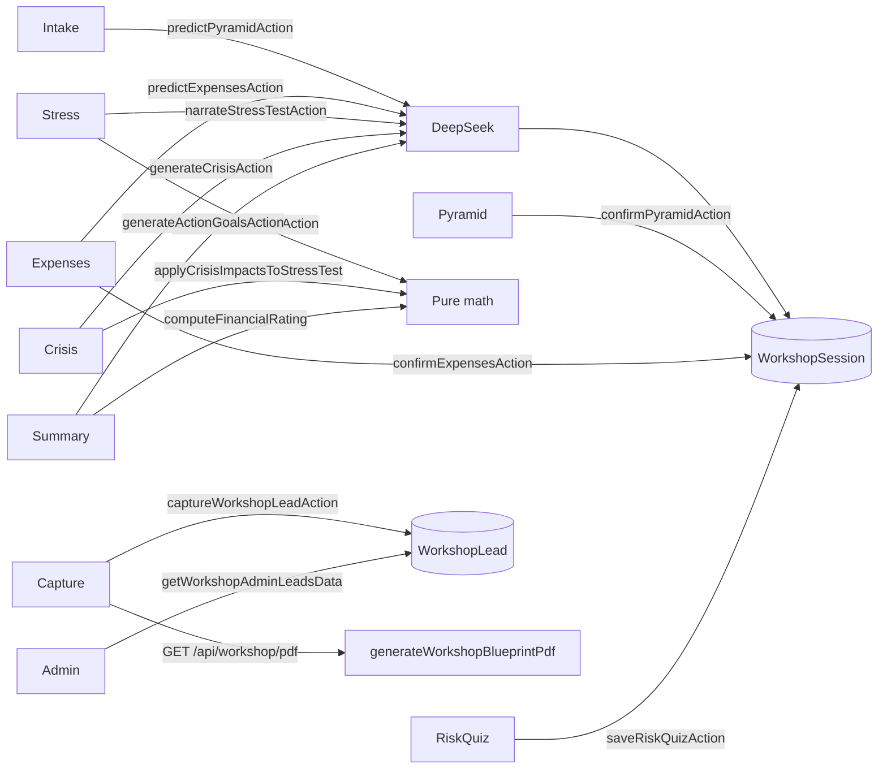

# Workshop Pyramid Lab — Source of Truth

**This document is the single source of truth** for the hidden Workshop Pyramid Lab.  
If implementation and this doc disagree, update this doc when you change the feature.

| Item | Value |
|------|--------|
| **Product name** | Workshop Pyramid Lab |
| **Version** | v2 (tone + redesigned pyramid + expenses + stress test + risk quiz + rating/action goals) |
| **Public URL (production)** | https://profitpulseally.com/workshop/pyramid |
| **Local URL** | http://localhost:3000/workshop/pyramid |
| **Admin leads** | `/admin/workshop` (ADMIN only) |
| **Status** | Live workshop tool (pilot / session use) — **not** Market Pulse, Matching Pulse, or Fortify |
| **Discovery** | Direct URL / QR only — **no** homepage, nav, or footer links |
| **App root** | Project root (Next.js App Router + React + TypeScript) |

---

## 1. Product intent

Workshop Pyramid Lab is a **private, full-page wizard** for live sessions (e.g. QR on a slide). Attendees:

1. Pick an **AI advisor tone**, then enter a simple profile (age, income, industry, household).
2. Get an AI-estimated **4-layer pyramid** (Protection → Emergency Fund → Goals → Investment & Fun), tune against deterministic benchmarks (green/amber/red), then confirm.
3. Review and edit an AI-guessed **monthly expenses** breakdown (5 categories; total is always a deterministic sum).
4. Run a **goal stress test** (deterministic surplus / inflation waterfall + AI notes only for amber/red items).
5. Take a **5-question risk quiz** → conservative / balanced / aggressive profile.
6. Face a personalized **crisis** with structured per-layer impacts (flavored by risk profile).
7. See a **financial rating (0–100)** and pick a **#1 action goal** from three ranked goals (impact points are pure math; titles/reasoning from AI).
8. Capture name / email / **required phone** → download a **graphical AI Financial Blueprint** PDF.

**Core rule:** DeepSeek (`callDeepSeek`) = guesses, narrative, and tone only. **All math** (benchmarks, stress test, rating, impact points, expense totals, risk quiz score) = pure TypeScript.

**Hard constraints (do not violate):**

- Do **not** change Market Pulse scoring, reveal gating, PPA privacy, launch gating, playability, or admin cycle logic.
- Do **not** modify Matching Pulse marketplace behavior or Fortify (`/fortify-survey`, `FortifyYourFutureSurvey.tsx`).
- Do **not** create duplicate users from workshop forms — leads are **not** Auth.js `User` rows.
- Workshop code lives under workshop paths only (see §3). Keep isolation.

---

## 2. Public entry & QR

### Canonical URL

```text
https://profitpulseally.com/workshop/pyramid
```

- Scheme: `https`
- Host: `profitpulseally.com` (**no** `www`)
- Path: `/workshop/pyramid` (**no** trailing slash required)
- No query params required for the base experience

### QR for live sessions

1. Paste the canonical URL into any free QR generator.
2. Export PNG/SVG; prefer high error correction for projection/print.
3. Before the room: scan on a phone and confirm intake loads.
4. Leave quiet margin around the code; do not stretch non-uniformly.

Local check after deploy:

```bash
curl -sI "https://profitpulseally.com/workshop/pyramid" | head -5
```

Expect `200` (or a redirect that still resolves to this path), not `404`.

---

## 3. File map (owned surfaces)

| Area | Paths |
|------|--------|
| Public page | `src/app/workshop/pyramid/page.tsx`, `loading.tsx` |
| Admin page | `src/app/admin/workshop/page.tsx` |
| PDF API | `src/app/api/workshop/pdf/[sessionId]/route.ts` |
| UI | `src/components/workshop/*` |
| Admin table | `src/components/admin/workshop/WorkshopLeadsAdminTable.tsx` |
| Domain lib | `src/lib/workshop/*` |
| Schema | `WorkshopSession`, `WorkshopLead` in `prisma/schema.prisma` |
| Route chrome | `/workshop/pyramid` in `FULL_PAGE_ROUTES` (`src/lib/layout/route-chrome.ts`) |
| Admin overview link | Secondary text in `AdminOverviewCards.tsx` |
| i18n (wizard) | `src/lib/i18n/messages/workshop-messages.ts` + `workshop-messages.zh-Hant.ts` (same split-catalog pattern as `acquisition-messages.ts`); registered via `en.ts` / `zh-Hant.ts` |
| i18n (admin link) | `auth.admin.quickActions.workshopLeads` in `auth-app-messages.ts` |
| CJK PDF font | `public/fonts/noto-sans-tc/` (Noto Sans TC Regular + Bold, SIL OFL) |

**Intentionally outside / must not grow into:** homepage, site nav/footer, Market Pulse libs, Matching Pulse request board, Fortify survey.

---

## 4. Routes & chrome

| Route | Auth | Chrome | Notes |
|-------|------|--------|--------|
| `/workshop/pyramid` | Public (no login) | Full page (no site header/footer) | `robots: { index: false, follow: false }` |
| `/admin/workshop` | ADMIN session | Full page (under `/admin`) | Non-admin → `redirect("/")` |
| `GET /api/workshop/pdf/[sessionId]` | None | N/A | Requires existing lead for that session; Node runtime |

**Metadata (public):**

- Title: `Workshop Pyramid Lab | Profit Pulse Ally`
- Description: `Private workshop pyramid lab session.`

**Loading:** `src/app/workshop/pyramid/loading.tsx` — obsidian skeleton, “Loading workshop…”.

---

## 5. Wizard flow (UI)

Orchestrator: `src/components/workshop/WorkshopWizard.tsx`  
Step order SSOT: `src/lib/workshop/wizard-steps.ts` (`TOTAL_STEPS = 8`).

```text
intake → pyramid → expenses → stresstest → riskquiz → crisis → summary → capture
```

| Step | Component | What the user sees |
|------|-----------|--------------------|
| **intake** | Inline in `WorkshopWizard` + `WorkshopToneSelector` | Tone (required) + age, monthly income (HKD), industry (+ chips), household → “Analyze my pyramid” |
| **pyramid** | `WorkshopPyramidStep` + layer editors | Clip-path pyramid graphic + Protection / Emergency Fund / Goals / Investment editors → Confirm |
| **expenses** | `WorkshopExpensesStep` | AI-guessed 5 monthly categories; live deterministic total → Confirm |
| **stresstest** | `WorkshopStressTestStep` | Year scrubber, surplus waterfall, EF + goal status cards; AI notes only on amber/red |
| **riskquiz** | `WorkshopRiskQuiz` | 5 tappable questions → save profile |
| **crisis** | `WorkshopCrisisStep` | Scenario card + structured red impact cards + goal-delay addendum |
| **summary** | `WorkshopSummaryStep` | SVG rating gauge, breakdown bars, 3 selectable action goals |
| **capture** | `WorkshopCaptureStep` | Name, email, **required** phone → PDF download |

### Tone system

Defined in `src/lib/workshop/tone.ts` / `WorkshopTone`:

| Id | Label |
|----|--------|
| `fun` | Fun & Metaphorical |
| `professional` | Professional & Formal (session default) |
| `simple` | Simple & Educational |
| `direct` | Direct & No-Nonsense |
| `warm` | Warm & Encouraging |

`getToneInstruction(tone)` is injected into every DeepSeek system prompt so narrative output stays distinctly different per tone. Tone is stored on `WorkshopSession.tone`.

### Intake options (hard-coded)

**Industry chips / suggestions:** Tech, Finance, Healthcare, Legal, Real Estate, Civil Service, Education, F&B/Hospitality, Self-Employed, Other (free text also allowed).

**Household status:** Single, Married no kids, Married with kids, Single parent.

### Pyramid layers (v2 shapes)

Canonical type: `PyramidState` in `src/lib/workshop/types.ts`.

| Key | Label | Editor | Meaning |
|-----|-------|--------|---------|
| `protection` | Protection | `ProtectionLayerEditor` | Medical coverage % + critical illness amount (HKD) |
| `emergencyFund` | Emergency Fund | `EmergencyFundLayerEditor` | Saved amount (HKD) |
| `goals` | Goals | `GoalsLayerEditor` | List of goals (icon, label, target amount, target year) |
| `investment` | Investment & Fun | `InvestmentLayerEditor` | Linked L/M/H risk allocation (sum 100), monthly investment, monthly fun |

**Benchmarks / flags:** `pyramid-benchmarks.ts` → `buildPyramidBenchmarks`, `computeLayerFlags` → each layer `green` | `amber` | `red` vs HK-oriented rules (medical %, CI multiple of income, EF months by industry, risk glide path by age).

AI may still return narrative rationale; status colors are **never** AI — they come from `computeLayerFlags`.

### Expenses categories (fixed 5)

| Key | Label | Icon (Lucide) |
|-----|-------|---------------|
| `housing` | Housing | `Home` |
| `food_living` | Food & Living | `UtensilsCrossed` |
| `transport` | Transport | `Bus` |
| `insurance` | Insurance | `Shield` |
| `discretionary` | Discretionary | `Sparkles` |

`totalHKD` = sum of category amounts (client + server). AI guesses amounts; app never trusts an AI total.

### UX details

- Step dots + “Step N of 8” / “第 N 步，共 8 步” via `WIZARD_STEP_LABEL_KEYS` → workshop catalog
- Shared wizard header includes **`LanguageSwitcher`** on **every** step (`EN` / `繁`) — locale cookie `ppa_locale` (`en` | `zh-Hant`); UI copy via `useTranslations()` / `useLocale()`
- On narrow screens the LanguageSwitcher sits on a **second row** under the title so the 8 progress dots stay legible (~12px) and never share horizontal space with locale chips; locale chips use ≥44×44 hit targets (`touchFriendly`)
- Intake AI call padded to **≥ 1500ms** (`MIN_PREDICT_MS`) so the “analyzing” state is visible
- Icons: `lucide-react` in the web UI; PDF uses **no icon fonts** (color + typography + SVG graphics only)
- Workshop shell uses `overflow-x-hidden` + `min-w-0` so wide mono amounts / CJK labels do not cause horizontal scroll; expense rows and goal amount/year grids stay **single-column** below the `sm` breakpoint

#### `WorkshopNumberField` (`src/components/workshop/WorkshopNumberField.tsx`)

Shared numeric control for the entire wizard (replaces raw `type="number"` inputs):

| Variant | `inputMode` | Notes |
|---------|-------------|--------|
| `currency` | `decimal` | `$` adornment; thousand separators on blur (“8,000”); raw digits while focused |
| `percent` | `numeric` | `%` adornment; clamped 0–100 |
| `age` / `year` / `plain` | `numeric` | Integer parse; optional `min`/`max` clamp |

- Always `type="text"` with manual parse (no browser spinner / separator fights)
- Input font **≥16px** (`text-base`) to prevent iOS Safari focus zoom
- `enterKeyHint` (`next` / `done`); on focus, delayed `scrollIntoView({ block: "center" })` so the field clears the keyboard
- Used for intake age/income, pyramid amounts/years, medical %, expenses, risk % (mobile)

#### `WorkshopStickyFooter` (`src/components/workshop/WorkshopStickyFooter.tsx`)

Fixed bottom action bar on every step (primary CTA + optional Back):

- Safe-area padding via `env(safe-area-inset-bottom)`; primary control `min-h-14`
- **Keyboard avoidance (iOS Safari):** listens to `window.visualViewport` `resize` / `scroll`. Sets `bottom` to `innerHeight − visualViewport.height − visualViewport.offsetTop` so the bar sits **above** the keyboard (layout viewport would otherwise leave `position: fixed; bottom: 0` behind it). Falls back to `bottom: 0` when `visualViewport` is missing. Small height jitter while the keyboard stays open (e.g. name → email → phone) is ignored so the footer does not flicker
- Scrollable step content uses `workshopStickyContentPadClass` so the last field is not covered when the keyboard is closed

#### Sliders & risk nudges

- `WorkshopRangeSlider`: **44×44** thumb hit target (visual knob ~28px via radial fill); `touch-action: none` on the control so drag does not scroll the page; **tap-to-jump** on pointerdown anywhere on the track
- Risk allocation (low/mid/high): below **400px** width, hide the slider track and use **±5% nudge buttons** (44×44) flanking a `WorkshopNumberField` `percent` field; at ≥400px keep the coarse slider between nudges. All paths call `redistributeRiskAllocation` so the three buckets always sum to 100
- Stress-test year scrubber: parent `touch-pan-y`, scrubber wrapper `touch-none`; same tap-to-jump behavior
- Workshop buttons / radios use `touch-action: manipulation` (class + `.workshop-lab` CSS) to drop the legacy 300ms tap delay

### i18n & bilingual AI copy

User-facing UI strings live in the **workshop message catalogs** (not hard-coded English in components):

| Locale | Catalog |
|--------|---------|
| `en` | `src/lib/i18n/messages/workshop-messages.ts` (`workshopEnMessages`) |
| `zh-Hant` | `src/lib/i18n/messages/workshop-messages.zh-Hant.ts` (`workshopZhHantMessages`) |

Structure matches `acquisition-messages.ts` / `acquisition-messages.zh-Hant.ts`: a flat `workshop.*` key map, re-exported into the site `en` / `zh-Hant` message unions. Components use `useTranslations()` (and `useLocale()` when picking stored bilingual fields). Deterministic enums (expense category keys, risk profile, layer flags, rating `labelKey`) stay as keys; display labels come from the catalog.

**`Bilingual` type** (`src/lib/workshop/types.ts`): `{ en: string; zhHant: string }`.

DeepSeek narrative calls append `BILINGUAL_JSON_INSTRUCTION` (`bilingualFields: true` on `callDeepSeek`) so **one** AI response stores both languages. UI picks with `pickBilingual(value, locale)` — switching language mid-session flips AI copy **without** a new DeepSeek call.

| Field | Where |
|-------|--------|
| Goal `label` | `GoalItem` / stress-test `GoalProjection` |
| Pyramid `rationale` | Stored with AI pyramid JSON (session); shown on pyramid step |
| Crisis `title`, `description`, impact `headline` | `CrisisState` / `CrisisImpact` |
| Stress-test `note` | `StressTestNote` (amber/red only) |
| Action goal `title`, `reasoning` | `ActionGoal` |

Structural guesses with no end-user prose (e.g. expense **amounts**) are **not** bilingual objects — category display labels come from `workshop.expenses.categories.*`.

---

## 6. Architecture & data flow



**Rules of thumb:**

- AI **only** via `src/lib/workshop/deepseek-client.ts` → `callDeepSeek`
- Stress-test surplus, inflation, EF/goal projections, financial rating, impact points, risk quiz scoring, expense totals, and layer flags are **deterministic**
- Session rows are anonymous workshop state; leads are contact capture only
- Legacy helpers (`simulateMacroTimeline`, `applyCrisisToTimeline`, `goal-pmt.ts`, `generateGoalsAction`) may still exist in lib for tests / compatibility — **wizard v2 does not use them**

---

## 7. Server actions

All in `src/lib/workshop/pyramid-actions.ts` (`"use server"`) except lead capture.

| Action | Purpose | Writes |
|--------|---------|--------|
| `predictPyramidAction` | DeepSeek v2 pyramid estimate + tone | `workshopSession.create` — `tone`, `aiPyramidJson`, seeds `finalPyramidJson` |
| `confirmPyramidAction` | Persist edited `PyramidState` | Updates `finalPyramidJson` |
| `predictExpensesAction` | DeepSeek 5-category expense guess | Seeds client state (persist on confirm) |
| `confirmExpensesAction` | Persist expenses; recompute `totalHKD` | Updates `expensesJson` |
| `runGoalStressTestAction` | Wrapper around pure `runGoalStressTest` | None (math only) |
| `narrateStressTestAction` | DeepSeek amber/red notes only | Updates `macroResultJson` with stress + notes |
| `saveRiskQuizAction` | Persist quiz answers + profile | Updates `riskQuizJson` |
| `generateCrisisAction` | DeepSeek crisis + structured `impacts[]` | Updates `crisisJson` |
| `generateActionGoalsAction` | Rating (math) + 3 action goals (AI titles/reasoning) | Updates `goalsJson` as `{ rating, actionGoals }` |
| `captureWorkshopLeadAction` | Validate + save lead | `workshopLead.upsert` by `sessionId` (`lead-actions.ts`) |

Legacy (not wired by the v2 wizard): `narrateMacroTimelineAction`, `generateGoalsAction`.

### Important Next.js constraint

Do **not** `export type { SomeType }` (re-export) from `"use server"` files — Next can register it as a server action and throw `SomeType is not defined` at runtime. Import types from their defining modules (e.g. `types.ts`, `macro-simulation.ts`) instead.

---

## 8. DeepSeek / AI client

**File:** `src/lib/workshop/deepseek-client.ts`

| Setting | Value |
|---------|--------|
| SDK | `openai` (^7.x) pointed at DeepSeek |
| Base URL | `https://api.deepseek.com/v1` |
| Default model | `deepseek-chat` (also supports `deepseek-reasoner`) |
| Timeout | **45s** per attempt (`REQUEST_TIMEOUT_MS`) |
| Env | `DEEPSEEK_API_KEY` (required) |
| JSON mode | `response_format: json_object` + system reminder; strips ```json fences if present |
| Retry | **Up to 3** completion attempts with exponential backoff on network/timeout, empty content, **429**, and **5xx**. Parse/schema failures re-request via `callDeepSeekParsed` (2 parse attempts). Non-retryable: missing key, ordinary 4xx |
| Fallbacks | Intake pyramid + expenses: after AI retries fail, use **deterministic local guesses** so the live session can continue (rationale explains the fallback in EN / zh-Hant). Stress notes: empty array. Crisis / goals / action goals: still surface Retry |
| Serverless | `maxDuration = 60` on `/workshop/pyramid` so Vercel does not kill mid-retry |
| Init | **Lazy** client construction (SDK requires non-empty apiKey at `new OpenAI(...)`); SDK `maxRetries: 0` (we own backoff) |
| Tone | Every call that narrates must include `getToneInstruction(tone)` |
| Bilingual | Narrative calls set `bilingualFields: true` → appends `BILINGUAL_JSON_INSTRUCTION`; parsers use `assertStrictBilingual` |

### Local setup

```bash
# .env.local (gitignored)
DEEPSEEK_API_KEY=sk-...
```

Then restart `npm run dev` so Next loads the env and refreshes any cached Prisma client.

Also needs normal Prisma DB env (`POSTGRES_URL` / project defaults).

### Rotate keys

Never commit keys. If a key was pasted into chat or logs, rotate it in the DeepSeek dashboard and update `.env.local`.

---

## 9. Deterministic simulation (stress test + crisis)

**File:** `src/lib/workshop/macro-simulation.ts`

### Goal stress test — `runGoalStressTest` / `runGoalStressTestAction`

Primary v2 simulation used by the wizard:

- Default horizon in UI: **30 years**
- Expense / goal-cost inflation: **`INFLATION_RATE = 0.03`** (hardcoded)
- Builds `monthlySurplusByYear` (income, expenses, surplus) — wage curve + inflating expenses (“waterfall”)
- Emergency fund: target months (industry) vs projected months to fund → `green` / `amber` / `red`
- Each pyramid goal: projected attainment year (or `null` = not reached) vs target year → status flag
- AI (`narrateStressTestAction`) may attach short notes **only** for amber/red items; green stays quiet

### Crisis overlay — `applyCrisisImpactsToStressTest`

- Takes baseline `StressTestResult` + crisis params (income hit %, one-time cost, duration)
- Recomputes goal delays / EF under shock for the crisis UI addendum
- AI invents **scenario narrative + structured impacts**; math applies the shock

### Legacy (v1) helpers still in file

- `simulateMacroTimeline` / `applyCrisisToTimeline` — old foundation/core/growth/apex cash path (CPI, growth shocks). Covered by tests; **not** the v2 wizard path.

---

## 10. Rating & action goals

### Financial rating — `financial-rating.ts`

Pure math (`computeFinancialRating`):

| Breakdown key | Weight (`RATING_WEIGHTS`) |
|---------------|---------------------------|
| `protection` | 0.25 |
| `emergencyFund` | 0.25 |
| `goalsOnTrack` | 0.30 |
| `crisisResilience` | 0.20 |

Score 0–100 → **`labelKey`** bands (not a raw English display string):

| Score | `labelKey` | Catalog key |
|-------|------------|-------------|
| ≤40 | `needsAttention` | `workshop.summary.ratingLabels.needsAttention` |
| ≤70 | `goodRoomToGrow` | `workshop.summary.ratingLabels.goodRoomToGrow` |
| else | `strongFoundation` | `workshop.summary.ratingLabels.strongFoundation` |

`SummaryRating` is `{ score, labelKey, breakdown }` — UI and PDF translate `labelKey` via the workshop catalog for the active locale.

`computeGoalImpactPoints` estimates how many rating points an action in a category could reclaim (used on action goals).

### Action goals — `generateActionGoalsAction`

- Computes rating + impact points in TypeScript
- DeepSeek supplies only `title` / `reasoning` (and presentation fields) for **3 ranked** goals
- Categories: `protection` | `savings` | `investment` | `goal`
- Persisted in `goalsJson` as `SummaryState`: `{ rating, actionGoals }`
- User must select a **#1 focus** before capture (`selectedGoal` on the lead = goal title)

### Legacy PMT

`goal-pmt.ts` (0% / 6% monthly contribution helpers) remains tested but is **not** used by the v2 summary/PDF flow.

---

## 11. Lead capture & PDF

### Lead — `captureWorkshopLeadAction`

- Fields: `name`, `email`, **`phone` (required)**, `selectedGoal`, `sessionId`
- Phone: `validateWorkshopPhone` — `+852` + 8 digits, or general intl 8–15 digits (`phone.ts`)
- Email validated; upserts one lead per session
- **Not** an Auth.js user; no account creation

### PDF — `GET /api/workshop/pdf/[sessionId]`

- Implementation: `generateWorkshopBlueprintPdf` in `generate-pdf.tsx` (`@react-pdf/renderer`)
- Route loads session JSON including `expensesJson`, `riskQuizJson`, stress (`macroResultJson`), crisis, summary (`goalsJson`), and recomputes layer flags for colors
- **Locale:** reads `ppa_locale` server-side via `getServerSiteLocale()` (same cookie as the site switcher) and passes `locale` into the PDF generator
  - Static labels (title, section headings, disclaimer, layer names, rating labels, …) → `translate` / `translateWith` from `workshop-messages` for that locale
  - Stored `Bilingual` fields → `pickBilingual(..., locale)`
  - HKD amounts stay plain numeric figures in both locales (no locale-specific number formatting for this pilot)
- **CJK font (required):** **Noto Sans TC** (Regular + Bold OTFs under `public/fonts/noto-sans-tc/`, SIL Open Font License). Registered with `Font.register` as family `NotoSansTC` and applied as the PDF base `fontFamily` — `@react-pdf/renderer` defaults do **not** cover Traditional Chinese glyphs (would render as blank boxes without this)
- **Gate:** session must already have a `WorkshopLead` (400 if missing)
- **Auth:** none — possession of `sessionId` + existing lead is enough
- Filename pattern: `ppa-workshop-blueprint-{id8}.pdf`
- `Cache-Control: no-store`

**Graphical contents (as graphical as practical without icon fonts):**

1. Header: localized “Your AI Financial Blueprint” / “你的 AI 財務藍圖” + tone-appropriate subtitle from catalog
2. SVG pyramid: 4 stacked trapezoids colored by layer flag + key figures (layer labels localized)
3. SVG rating gauge (0–100) with score centered + translated `labelKey`
4. Horizontal goal progress bars (not pie); goal labels from `Bilingual`
5. 3-segment risk allocation bar (low/mid/high — not donut)
6. Crisis impacts: colored square + bilingual headlines
7. Three action goals with impact points + bilingual title/reasoning excerpt
8. Footer educational disclaimer from `workshop.pdf.disclaimer`

Capture UI triggers download shortly after successful lead save; “Download again” uses the same URL.

---

## 12. Database (Prisma)

```prisma
model WorkshopSession {
  id               String   @id @default(cuid())
  createdAt        DateTime @default(now())
  age              Int
  monthlyIncome    Float
  industry         String
  householdStatus  String?
  tone             String   @default("professional")
  aiPyramidJson    Json     // PyramidState — AI prediction
  finalPyramidJson Json     // PyramidState — user-confirmed
  macroResultJson  Json?    // StressTestResult (+ optional narrative notes)
  expensesJson     Json?    // ExpensesState
  riskQuizJson     Json?    // RiskQuizState
  crisisJson       Json?    // CrisisState
  goalsJson        Json?    // SummaryState { rating, actionGoals }
  lead             WorkshopLead?
}

model WorkshopLead {
  id           String          @id @default(cuid())
  sessionId    String          @unique
  session      WorkshopSession @relation(..., onDelete: Cascade)
  name         String
  email        String
  phone        String          // required
  selectedGoal String?
  createdAt    DateTime        @default(now())

  @@index([createdAt])
  @@index([email])
}
```

JSON shapes: see `src/lib/workshop/types.ts`.

After schema changes: `npx prisma db push` (or migrate) + `npx prisma generate`, then **fully restart** `npm run dev`. A long-lived Next process can cache an old `PrismaClient` on `globalThis` without `workshopSession` → errors like “missing WorkshopSession” / `Cannot read properties of undefined (reading 'create')`.

---

## 13. Admin: Workshop leads

| Item | Detail |
|------|--------|
| URL | `/admin/workshop` |
| Auth | `requireAdminSession()` (`src/lib/market-pulse/admin-auth.ts`) — `role === "ADMIN"` |
| Data | `getWorkshopAdminLeadsData()` — leads joined with session |
| Columns | Name, email, phone, industry, age, weakest layer, **risk profile**, **rating score**, selected goal, created (HKT display) |
| CSV | Client-side `buildWorkshopLeadsCsv` → `downloadCsv` → `workshop-leads-YYYY-MM-DD.csv` (includes `riskProfile`, `ratingScore`) |
| Overview link | Small secondary “Workshop leads →” under `/admin` quick actions |

- Weakest layer: parsed from `finalPyramidJson`, falling back to `aiPyramidJson` (legacy field if present)
- Risk profile: `riskQuizJson.profile`
- Rating score: `goalsJson.rating.score`
- Phone is always present (required on capture)

---

## 14. Errors & recovery

| Layer | Behavior |
|-------|----------|
| Outer `WorkshopErrorBoundary` | Wraps the whole step body in `WorkshopWizard` |
| Nested `WorkshopErrorBoundary` | pyramid, expenses, stresstest, riskquiz, crisis, summary, capture |
| `WorkshopRetryPanel` | Friendly panel for caught AI / save failures (intake, expenses predict/confirm, stress narrate, crisis, summary, pyramid confirm, risk quiz save) |
| Intake | Validation errors = alert; AI failures = Retry (resubmit) |
| Stress / crisis / summary | In-step Retry via `retryToken` / remount |
| DeepSeek client | Up to 3 network/429/5xx retries + parse re-request; intake/expenses deterministic fallback; clear message if key missing |
| Stale Prisma | Explicit “restart npm run dev” message when `workshopSession` missing |

---

## 15. Dependencies (workshop-specific)

| Package | Role |
|---------|------|
| `openai` | DeepSeek-compatible chat client |
| `lucide-react` | Workshop UI icons (stat cards, tones, quiz, goals) |
| `framer-motion` | Light motion on cards / stress notes |
| `@react-pdf/renderer` | Graphical blueprint PDF (Svg/Path — no icon fonts) |

---

## 16. Tests

```bash
npx vitest run src/lib/workshop
```

| File | Covers |
|------|--------|
| `macro-simulation.test.ts` | Legacy macro path + `runGoalStressTest` inflation/surplus + crisis overlay |
| `pyramid-benchmarks.test.ts` | Benchmarks + layer flags |
| `risk-quiz.test.ts` | 5Q scoring → profile |
| `financial-rating.test.ts` | Rating weights, score, impact points |
| `investment-allocation.test.ts` / risk-allocation | L/M/H redistributes to 100 |
| `phone.test.ts` | Required phone validation |
| `leads-csv.test.ts` | CSV header incl. riskProfile / ratingScore + escaping |
| `goal-pmt.test.ts` | Legacy 0% / 6% PMT helpers |
| `WorkshopWizard.steps.test.ts` | 8-step order / labels |

No automated tests yet for DeepSeek client, most server actions, PDF route, or full React wizard UI.

---

## 17. Verification checklist (dev / session)

```bash
# Env
# DEEPSEEK_API_KEY set in .env.local

npx prisma generate   # after schema changes
npm run typecheck
npx vitest run src/lib/workshop

# Full restart after Prisma model changes
# Ctrl+C then:
npm run dev
```

Manual:

1. Open `/workshop/pyramid` — no site chrome; tone + intake loads.
2. Submit profile — AI pyramid appears with flag colors (not Retry / missing-key errors).
3. Confirm → expenses → stress test scrubber → risk quiz → crisis impacts → summary rating → pick #1 → capture with **required phone** → graphical PDF downloads.
4. Spot-check ~375px: pyramid sliders / risk ±5% controls usable with touch.
5. As ADMIN: `/admin/workshop` shows phone, risk profile, rating score; CSV export works.
6. Guest/USER must not access admin leads (redirect home).

Production smoke: hit canonical URL; scan QR; run one full attendee path; confirm lead in admin.

---

## 18. What this is / is not

| Is | Is not |
|----|--------|
| Hidden workshop lab for live sessions | Homepage / MVP feature |
| Anonymous session + lead capture | Auth.js user signup |
| Educational stress-test + blueprint | Regulated financial advice |
| ADMIN ops list + CSV | Public request board / marketplace |
| Isolated Prisma models + workshop libs | Part of Market Pulse scoring |
| Tone-aware AI narrative + pure-math scoring | Marketplace, credits, or token system |

---

## 19. Change log (doc)

| Date | Note |
|------|------|
| 2026-08-04 | Initial SSOT doc for Workshop Pyramid Lab (wizard, AI, math, PDF, admin, QR URL). |
| 2026-08-04 | **v2 rewrite:** 8-step flow (tone, expenses, stress test, risk quiz, crisis impacts, rating/action goals); redesigned pyramid layers; required phone; graphical PDF; admin risk profile + rating columns. |
| 2026-08-04 | **Bilingual EN / zh-Hant rollout:** `workshop-messages` catalogs + `LanguageSwitcher` on every wizard step; `Bilingual` AI fields; `SummaryRating.labelKey`; locale-aware PDF with Noto Sans TC. |
| 2026-08-04 | **Mobile UX hardening:** `WorkshopNumberField` (text + inputMode, ≥16px, currency/percent adornments); `WorkshopStickyFooter` with `visualViewport` keyboard avoidance; 44px slider thumbs + risk ±5% nudges under 400px; capture tel attrs; narrow/CJK overflow pass (360–428); tap-target + `touch-manipulation` sweep. |
| 2026-08-04 | **AI stability:** DeepSeek timeout 45s; 3× backoff retries on 429/5xx/timeout; `callDeepSeekParsed` re-requests on bad JSON/bilingual; deterministic intake/expenses fallback; `/workshop/pyramid` `maxDuration = 60`. |
| 2026-08-04 | **Build fix:** move sync fallback helpers out of `"use server"` `pyramid-actions.ts` into `ai-fallbacks.ts` (Next requires exported server actions to be async). |

When you change behavior, update **this file** in the same PR.
